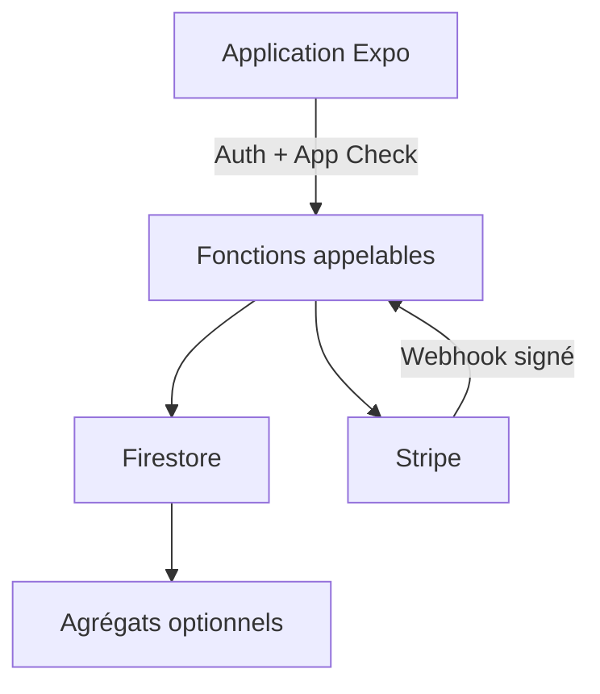

# Architecture

## Frontière de confiance

L'application mobile est un client non fiable. Elle peut afficher un calcul prévisionnel, mais elle ne décide jamais en production du score validé, du rôle d'un membre, du statut d'abonnement, de l'heure serveur ou de l'appartenance à un foyer.

## Couches mobiles

- **Routes** : orchestration des écrans, navigation et accessibilité.
- **Store** : état de démonstration en mémoire et actions UI.
- **Domaine** : calculs déterministes, périodes, droits et validation locale.
- **Services** : interface de données. L'adaptateur démo n'effectue aucun accès réseau ; l'adaptateur production ne s'active que par configuration explicite.

## Écritures privilégiées

Les mutations sensibles passent par des fonctions serveur : création du foyer, invitation, rattachement d'un membre, tâche terminée, consentement, création de session Checkout et synchronisation d'abonnement. Les règles Firestore refusent les modifications directes de champs calculés ou privilégiés.

## Décisions de sécurité

- identifiants d'invitation à forte entropie, stockés sous forme de condensat côté serveur et à durée limitée ;
- validation stricte des entrées et limites de taille ;
- autorisation fondée sur les adhésions stockées, jamais sur une valeur fournie par le client ;
- temps serveur et transaction pour les mutations concurrentes ;
- webhook Stripe signé, idempotent et avec protection contre les événements trop anciens ;
- consentement analytique séparé, facultatif, désactivé par défaut et révocable ;
- collecte agrégée désactivée tant qu'une base juridique et une politique validées ne sont pas configurées ;
- journaux sans données sensibles ni corps de webhook complet.

## Déploiement

La CI vérifie le typage, les tests, les règles Firebase et les dépendances. Le déploiement reste manuel et nécessite un environnement protégé. Aucun workflow provenant d'une pull request ne reçoit de secret de production.
